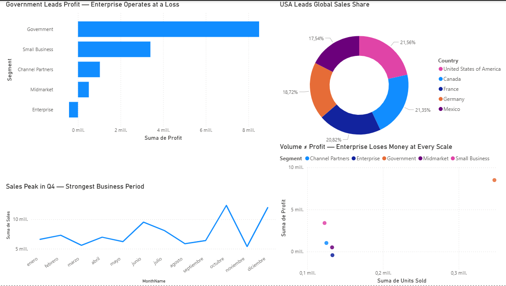
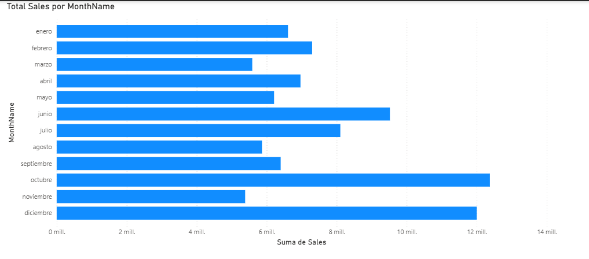
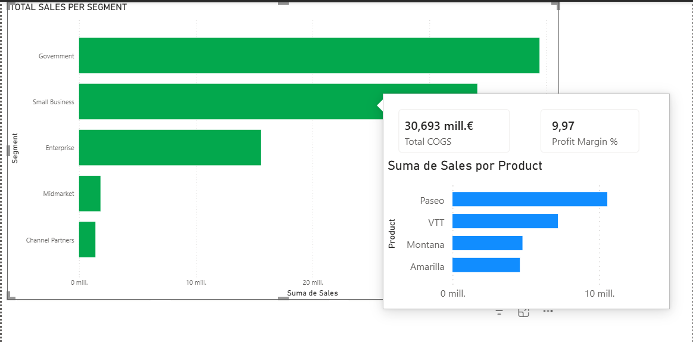
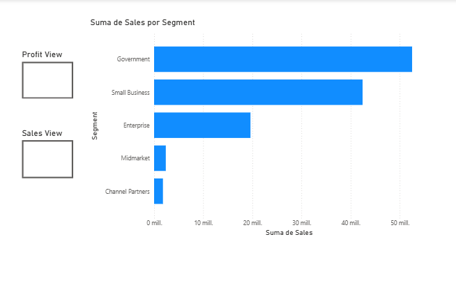
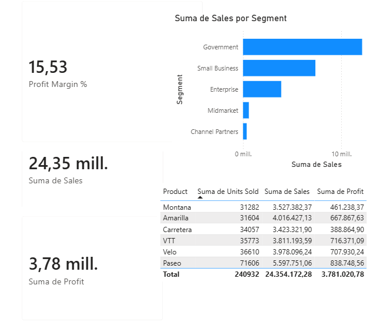
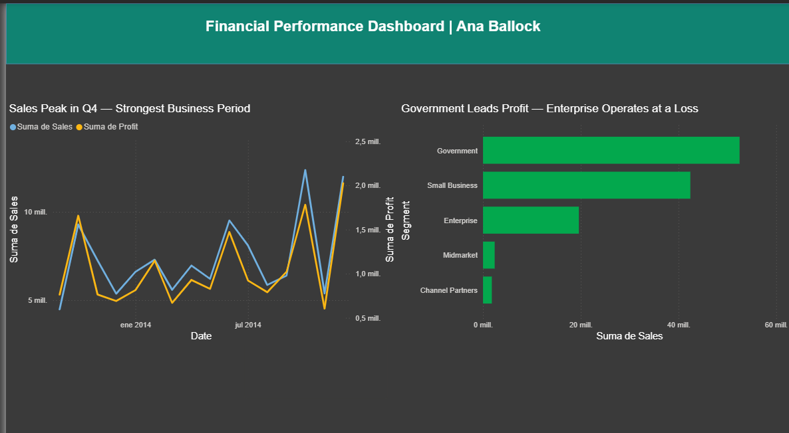
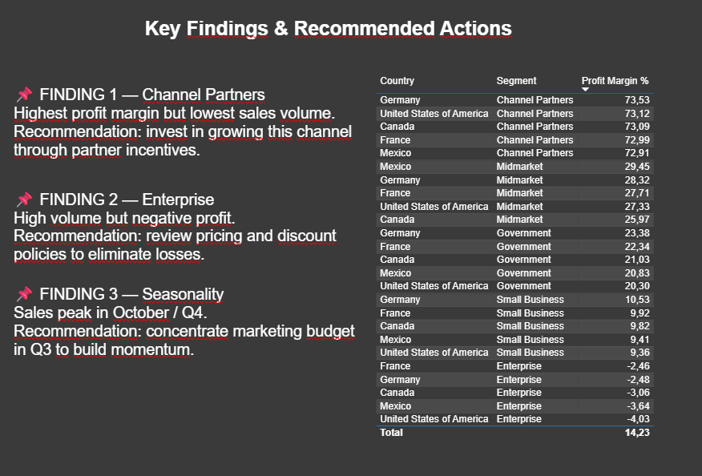

# Power BI – Data Visualization & Dashboard Design

**Ana Ballock** · [LinkedIn](https://linkedin.com/in/anaballock) · [GitHub](https://github.com/apballock)

---

Advanced Power BI project focused on visualization strategy, dashboard UX design, and analytical storytelling — covering chart selection logic, interactive time hierarchies, and custom tooltip architecture.

---

## Skills Demonstrated

Data storytelling · Visualization strategy · Dashboard UX design · Time-series analysis · Correlation analysis · Interactive report design · Cross-filter debugging · Business insight communication

---

## Project Structure

```text
├── Exercise 1 – Chart Selection & Visual Strategy
│   ├── Profit by Segment (Bar Chart)
│   ├── Monthly Sales Trend (Line Chart)
│   ├── Country Sales Share (Donut Chart)
│   └── Units Sold vs Profit (Scatter Plot)
├── Exercise 2 – Date Hierarchy & Drill-Down
└── Exercise 3 – Custom Tooltip Page
```

---

## Exercise 1 — Chart Selection & Executive Dashboard

Designed a four-panel executive dashboard applying deliberate chart selection logic — matching each visualization type to its analytical purpose rather than defaulting to generic visuals.

| Business Question | Visual Selected | Rationale |
|---|---|---|
| Which segment generates the most profit? | Bar Chart | Categorical comparison |
| How did sales evolve month by month? | Line Chart | Continuous time-series |
| What share of sales does each country hold? | Donut Chart | Part-to-whole contribution |
| Is there a relationship between volume and profit? | Scatter Plot | Correlation & outlier detection |



---

### Profit by Segment

Clustered bar chart sorted descending by Profit, surfacing a counterintuitive result: the **Enterprise** segment operated at a loss while **Government** led in profitability — despite Enterprise having significant sales activity.

Chart title written as an analytical conclusion rather than a label:
> *Government Leads Profit — Enterprise Operates at a Loss*

This framing converts the visual from a data display into an executive-ready insight.

---

### Monthly Sales Trend

Line chart plotted against the Calendar table's `MonthName` field (sorted by `MonthNumber`) to ensure chronological accuracy. The trend confirmed a strong Q4 acceleration with **October** as the peak sales month, consistent with typical end-of-year commercial patterns.

---

### Country Sales Share

Donut chart with percentage labels showing **USA as the largest contributor** to total sales. During analysis, a cross-filter interaction temporarily shifted the apparent top country to Germany — a realistic reminder that active visual selections alter aggregation context and must be accounted for when communicating findings to non-technical stakeholders.

---

### Units Sold vs Profit — Scatter Plot

Scatter plot segmented by business category, revealing that **sales volume and profitability are not correlated** in this dataset. Government clustered in the high-volume, high-profit quadrant. Enterprise landed below zero regardless of units sold — pointing to a structural pricing or cost issue independent of demand.

> *More units sold does not mean higher profit. Enterprise's losses are structural, not volumetric.*

---

## Exercise 2 — Date Hierarchy & Drill-Down Navigation

Built a three-level date hierarchy inside the Calendar table (Year → Quarter → Month) enabling users to drill through time granularities within a single visual — replacing what would otherwise require three separate charts and two additional pages.

| Level | Top Performer |
|---|---|
| Quarter | Q4 |
| Month | October |

During development, only 2014 data appeared in the hierarchy despite the dataset containing 2013 records. Root cause: a report-level filter from a prior exercise was silently restricting the full dataset. Resolved by auditing active filters — a practical example of how missing data in BI environments is often caused by filter state rather than broken relationships or incomplete sources.

**UX impact:** A single drill-down hierarchy reduces dashboard clutter, shortens time-to-insight, and supports both summary-level and granular analysis within the same view.



---

## Exercise 3 — Custom Tooltip Page

Implemented a custom Report Page Tooltip connected to the main Segment bar chart, delivering contextual profitability and cost metrics on hover without adding visual noise to the primary dashboard surface.

### Tooltip Components

| Visual | Metric |
|---|---|
| KPI Card | Profit Margin % |
| KPI Card | Total COGS |
| Mini Chart | Sales by Product |

### Design Challenges

Custom tooltip pages in Power BI don't auto-scale to tooltip dimensions — visuals overflow boundaries and typography breaks without manual intervention. Resolved through iterative layout optimization: increased the custom page canvas, adjusted card font sizes, restructured the visual arrangement for compact rendering, and re-enabled Tooltip mode after each modification.

This is a common production challenge in enterprise dashboard development where UI/UX engineering is as critical as analytical accuracy.

### Business Insight

On hover, **Channel Partners** consistently returned the highest Profit Margin % — confirming that this segment operates with significantly greater efficiency than its sales volume alone would suggest. Lower transaction volume paired with high margin is often a signal of premium positioning or favorable cost structure.



---

## Key Takeaways

- Chart type selection driven by analytical intent, not aesthetic preference
- Executive-ready insight titles used in place of generic chart labels
- Cross-filter behavior documented and communicated as a data literacy consideration
- Scatter plot analysis surfaced a structural profitability finding not visible in standard bar/line charts
- Drill-down hierarchy replaced three separate visuals with a single interactive component
- Custom tooltip architecture implemented with full layout optimization for production-ready rendering

---

# Interactivity & Dashboard UX Design

Advanced Power BI project focused on dashboard interaction architecture, contextual navigation, and executive-level UX design — transforming functional reports into polished, stakeholder-ready analytical products.

---

## Skills Demonstrated

Dashboard interaction design · Bookmark-based UI architecture · Drill-through navigation · Visual hierarchy · Layout design · Report storytelling · UX optimization for BI tools

---

## Project Structure

```text
├── Exercise 1 – Bookmark Navigation System
├── Exercise 2 – Drill-Through Analysis
└── Exercise 3 – UX Design & Visual Polish
```

---

## Exercise 1 — Bookmark-Based Navigation

Implemented a toggle UI pattern using Power BI Bookmarks and navigation buttons, enabling users to switch between two analytical perspectives — Sales by Segment and Profit by Segment — within a single page, without duplicating visuals or adding report pages.

Both charts were layered in the same canvas position, with visibility controlled via the Selection Panel. Two bookmarks captured each distinct visibility state, and navigation buttons were wired to their respective bookmarks to create an application-like switching experience.

**Design rationale:** Displaying both charts simultaneously would split the reader's attention. The toggle enforces one analytical question at a time, reducing cognitive load — a particularly important consideration for non-technical stakeholders who need to act on insights, not interpret layouts.

**Other production use cases for this pattern:** executive vs. operational views, KPI summary vs. detail toggle, guided storytelling presentations, and show/hide slicer panels.



---

## Exercise 2 — Drill-Through Navigation

Architected a drill-through system connecting a high-level overview to a dedicated **Country Detail** page, enabling analysts to move from pattern identification to root-cause investigation without losing filter context.

### Detail Page Components

| Visual | Purpose |
|---|---|
| Sales KPI Card | Total revenue by country |
| Profit KPI Card | Total profit by country |
| Profit Margin % Card | Operational efficiency |
| Sales by Segment Chart | Segment-level breakdown |
| Product Table | Transaction-level detail |

All visuals respond dynamically to the selected country context. A back button preserves navigation continuity.

### Business Findings

Canada returned **$24.89M in Sales** and **$14.18M in Profit**. France's **Profit Margin of 15.53%** positioned it as one of the more operationally efficient markets in the dataset.

### Drill-Through vs. Drill-Down

These are distinct navigation patterns serving different analytical needs:

| Pattern | Behavior | Best Used For |
|---|---|---|
| Drill-Down | Hierarchical exploration within the same visual | Time periods, geographic regions |
| Drill-Through | Navigation to a dedicated detail page | Entity-level deep dives (country, product, customer) |

Overview pages surface patterns. Detail pages explain them — this two-layer architecture mirrors how analysis actually happens in business environments.



---

## Exercise 3 — Executive Dashboard Redesign

Rebuilt the dashboard's visual layer from a technically functional but dense report into an executive-ready analytical product, applying UX design principles without modifying the underlying data model.

### Changes Applied

**Theme consistency** — applied a unified theme across all pages to standardize color, typography, and visual styling. In multi-developer or multi-page environments, themes are the primary mechanism for enforcing brand and design coherence at scale.

**Insight-driven titles** — replaced generic descriptive labels with analytical conclusions:

| Before | After |
|---|---|
| *Total Sales by Segment* | *Government Leads Profit — Enterprise Operates at a Loss* |

Titles written as conclusions allow executives to extract value from a glance, before reading the underlying chart.

**Structured header** — added a rectangle-backed header with the dashboard title and author attribution, establishing a clear visual entry point and professional ownership.

**Clutter reduction** — removed decorative borders, reduced visual density, and increased whitespace. Whitespace is a functional design element: it directs attention and reduces visual parsing time.

**Alignment** — used Power BI's alignment and distribution tools to standardize spacing and vertical positioning across all visuals, improving scan speed and structural legibility.

### Before vs. After

| Dimension | Before | After |
|---|---|---|
| Visual consistency | Fragmented | Unified theme |
| Hierarchy | Weak | Clear entry point and flow |
| Titles | Descriptive | Insight-driven |
| Density | Cluttered | Whitespace-optimized |
| Audience readiness | Technical | Executive-ready |

A dashboard that communicates poorly fails regardless of analytical depth. Visual design directly shapes how stakeholders perceive and act on findings.



---

## Key Takeaways

- Bookmark architecture enables multi-view dashboards without page proliferation
- Drill-through separates overview storytelling from operational detail, supporting natural analytical workflows
- Dashboard UX is not decorative — layout, hierarchy, and title framing directly impact how findings are understood and acted upon
- Insight-driven titles convert charts into conclusions, reducing the interpretive burden on non-technical audiences
- Theme enforcement and alignment tooling are essential practices for enterprise-grade report development

---

# Data Storytelling & Executive Reporting

End-to-end executive report built on Power BI, structured as a three-page analytical narrative that moves from performance overview to root-cause analysis to strategic recommendations — designed for C-level and director-level audiences.

---

## Skills Demonstrated

Data storytelling · Executive dashboard architecture · Multi-page report design · Business recommendation framing · Time-series analysis · Segment and geographic performance analysis · Report governance

---

## Report Architecture

The report follows a deliberate three-layer structure that mirrors real executive decision-making workflows:

```text
Page 1 – Executive Overview     → What is happening
Page 2 – Performance Analysis   → Why it is happening
Page 3 – Strategic Recommendations → What we should do
```

This separation ensures each page serves a distinct audience need — summary, diagnosis, action — without forcing executives to extract conclusions from raw charts.



---

## Page 1 — Executive Overview

High-level financial snapshot combining KPI cards (Sales, Profit, Profit Margin %) with a monthly sales trend line chart, giving leadership an immediate read on overall performance and seasonal behavior across 2013–2014.

The Calendar table's `MonthName` field, sorted by `MonthNumber`, ensures chronologically accurate trend rendering — a critical detail in time-series reporting where alphabetic sorting would silently distort the narrative.

**Key finding:** Sales follow a clear seasonal pattern with consistent Q4 acceleration, peaking in October.

---

## Page 2 — Business Performance Analysis

Deeper diagnostic layer built around three visuals: a Profit Margin % breakdown by Segment, a geographic Sales map, and a Country × Segment matrix for granular cross-dimensional analysis.

The analysis surfaces a structural imbalance across segments: high-volume segments do not correlate with high profitability, and vice versa. This divergence between revenue generation and margin efficiency is the central analytical finding that drives the recommendations on Page 3.

All visuals are cross-filter enabled — selections on any visual propagate context to the others, supporting interactive root-cause exploration during live stakeholder sessions.

---

## Page 3 — Strategic Recommendations

The decision layer of the report, translating analytical findings into three concrete business actions:

**Channel Partners — expand.** Highest Profit Margin % in the dataset despite the lowest sales volume. The efficiency signal justifies investment in partnership incentives and channel growth to scale a proven margin structure.

**Enterprise — reprice.** High sales volume paired with negative or near-zero profitability indicates a structural issue in pricing or discount policy — not a demand problem. Revenue optimization here is a cost/pricing exercise, not a sales one.

**Seasonality — shift spend earlier.** Q4, and October specifically, consistently outperforms. Moving marketing investment into Q3 would capture demand earlier in the acceleration curve rather than spending into a peak that is already occurring.

A supporting ranked table (Country × Segment × Profit Margin %) provides the validation layer for each recommendation, allowing stakeholders to interrogate the underlying data without leaving the page.

---

## Report Distribution

Exported to PDF via File → Export for static executive distribution, preserving the full multi-page narrative in a format accessible outside the Power BI environment.

**PDF vs. Power BI Service:** PDF is appropriate for fixed executive reporting and governance-controlled distribution. Power BI Service is preferable when stakeholders need live interactivity, filter exploration, or real-time data refresh.

Report structure and page ordering were finalized before export — in Power BI, PDF output reflects the full report as-built, making pre-export design decisions part of the communication strategy.

---

## Key Takeaways

- Three-page narrative architecture translates raw data into a decision-ready executive product
- Page-level separation of overview, analysis, and recommendations reduces interpretive burden on non-technical audiences
- Segment profitability analysis revealed that volume and margin efficiency are structurally decoupled in this dataset — a finding invisible in single-metric views
- Recommendations are grounded in specific analytical evidence, not general observations
- Report design and export strategy treated as part of governance and communication, not afterthoughts
